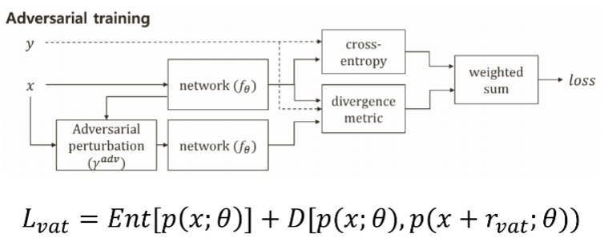

# Effective regularization for Text classification in data shortage
Tensorflow Implementation 2.3

[src](img.png)

When the text data is not abundant, as in other papers, we use only below 1%(upto 0.1%) of the whole labeled datas.et

We show that in this case, additional regularization is effective, especially when unlabeled data can be utilized.

Semi supervised learning uses unlabeled data. Simply, the architecture can be represented as below:

That is, it utilizes an entropy loss and a divergence loss from their permutation

# How to Run
1. `bash preprocess.sh`
2. `bash train.sh`

